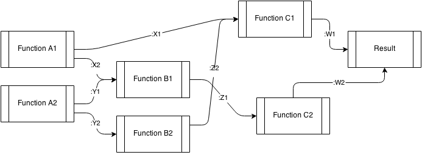
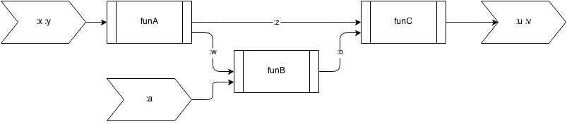

# DAG-Runner

Life is too short to be wasted on piping the output of one function
into the other. Concentrate on writing (awesome) functions and let
dag-runner do the (dirty) work of constructing the function execution
flow.

Yes, this is a Clojure library designed to execute functions that
dependent upon the output of each other as specified by a DAG
(directed acyclic graph).



## Usage

First prepare a bunch of awesome functions. The input argument of each
function in the flow should be taking key-value pairs and the output
should also be hash-maps. For example: 

Here we would like to run through three functions with to get the
ultimate output. 

```[clj]
(defn funA [{:keys [x y]}]
  {:z (+ x y)
   :w (- x y)})

(defn funB
  "this function would take :w of the output from funA."
  [{:keys [w a]}]
  {:b (* w a)})

(defn funC
  "this function would take :z from funA and :b from funB and the
  output :u :v are the ultimate output that we care about."
  [{:keys [b z]}]
  {:u (* b z)
   :v (- b z)}
  )
```
The topology of the above function flow can be visualized as: 



The function `dag-run` will create a super function `aggregated-fun`
(or any name you like) that takes all necessary inputs for the above
flow (`:x :y :a`), automatically run through all functions above, and
generate the ultimate output (`:u :v`).

```clj
(dag-run aggregated-fun
         [{:function funA :input [:x :y] :output [:z :w]}
          {:function funB :input [:w :a] :output [:b]}
          {:function funC :input [:b :z] :output [:u :v]}])

(aggregated-fun :x 1 :y 2 :a 3)
```

## ToDo

* Add parser layer to directly take input and output key from function
  definitions. 

* Add safeguard layer to make sure that the flow can finish.

## License

Copyright © 2014 FIXME

Distributed under the Eclipse Public License either version 1.0 or (at
your option) any later version.
