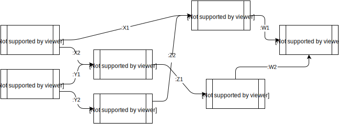

# DAG-Runner

A Clojure library designed to execute functions that dependent upon
the output of each other as specified by a DAG (directed acyclic
graph). 

## Usage

## License

Copyright © 2014 FIXME

Distributed under the Eclipse Public License either version 1.0 or (at
your option) any later version.
